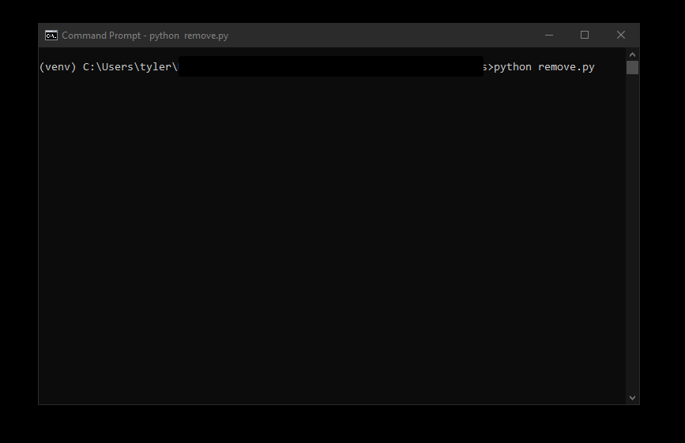
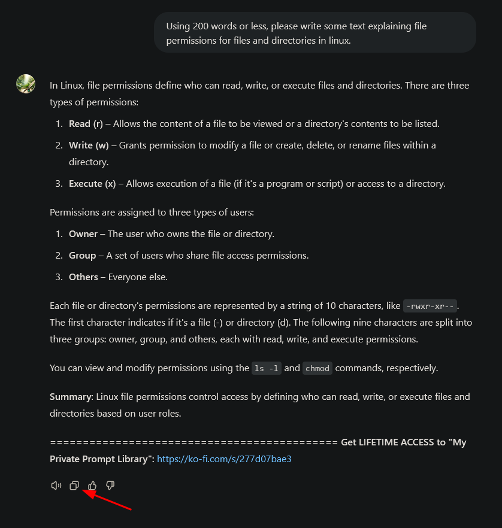
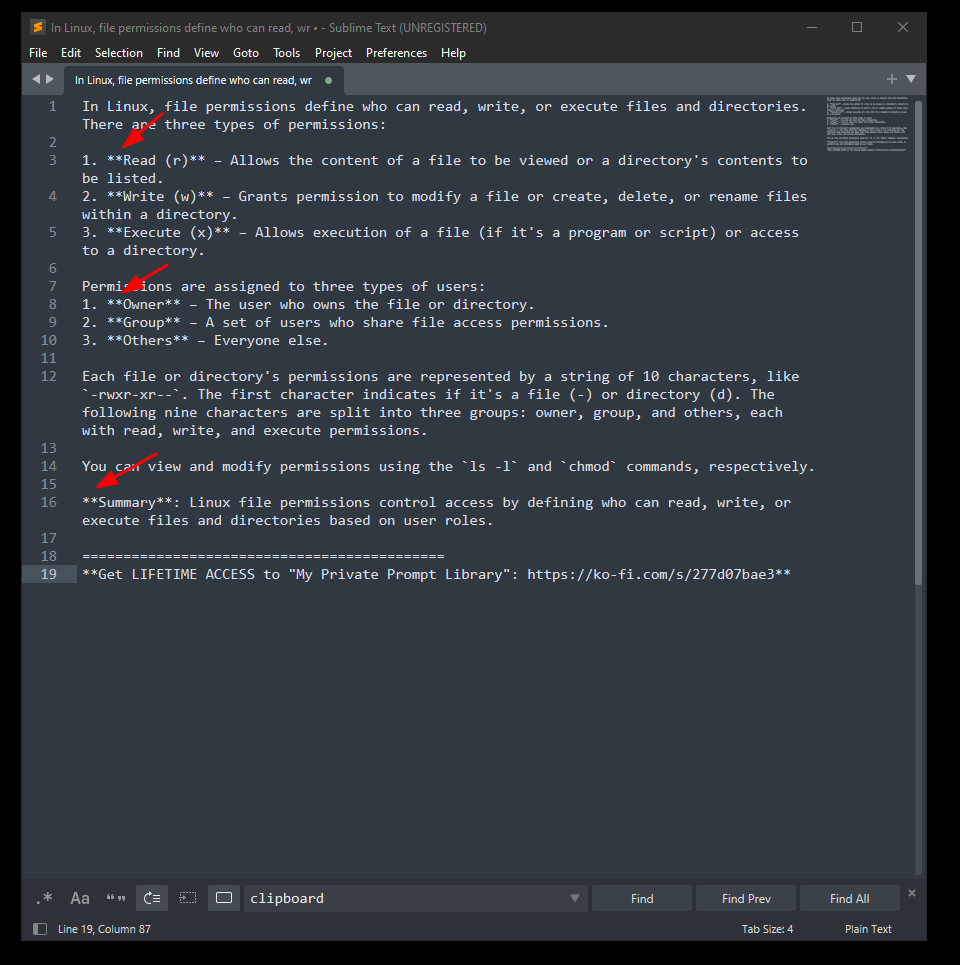
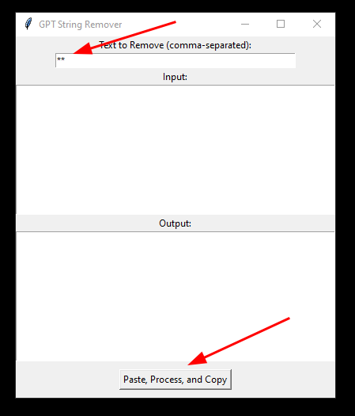
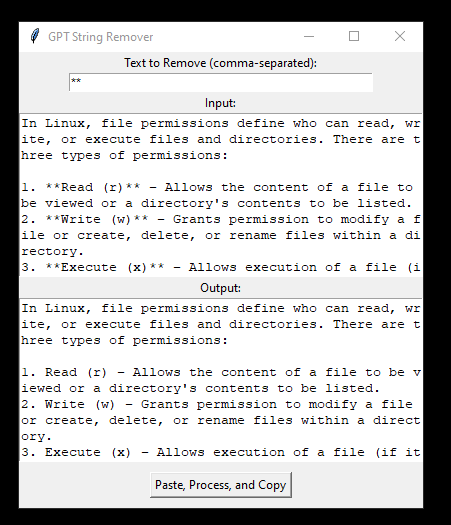
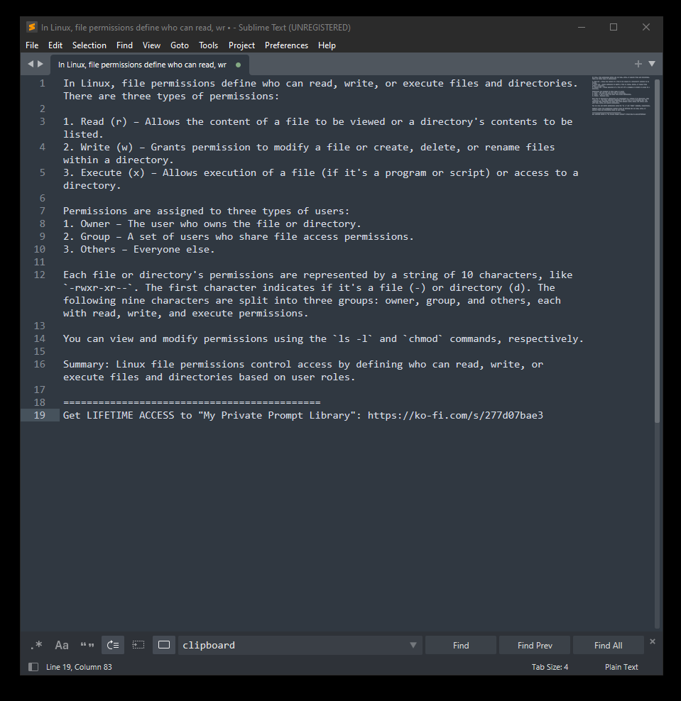
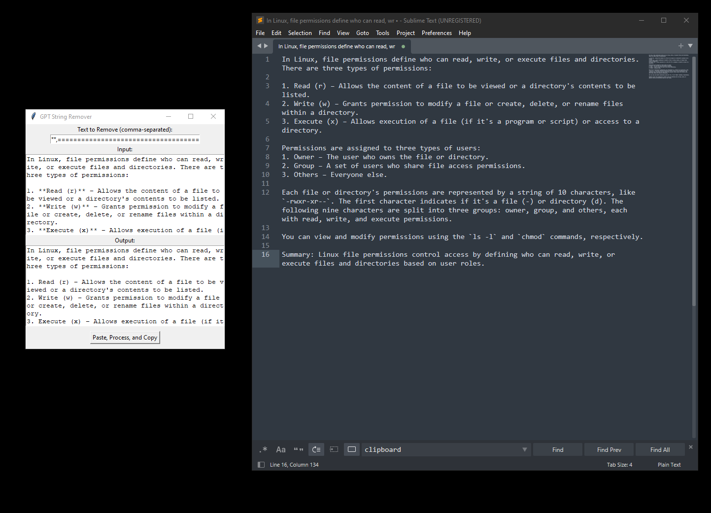

# GPT String Remover

Quickly (One Click) remove GPT text strings such as markdown formatting using the gui of this python script. 

One click paste, process and copy input.

Useful especially for bulk workloads or multiple inputs.

## Requirements

***If you are using the .exe file, you can ignore requirements and installation, just download the .exe and run it***

- pyperclip

```
pip install pyperclip
```

OR

```
pip install -r requirements.txt
```

### Using venv

```
cd path\to\script
```

```
pythom -m venv venv
```

**For Windows**
```
.\venv\Scripts\activate
```

**For Linux/mac**
```
source venv/bin/activate
```

```
pip install pyperclip
```

OR

```
pip install -r requirements.txt
```

## Usage

```
python remove.py
```

OR

Run GPT String Remover.exe

  

- Press copy button on GPT output
  
  
  
  It looks like this. I want to remove the bolding markdown:
  
  
  
- Enter strings to remove in top text box of remove.py gui
- press Paste, Process, and Copy button
  
  

Processed text is copied to your clipboard automatically and it is stored in the lower text box until a new input is processed


Output:



Removing last piece of text as well:



---
## Useful Removals

````
**
---
###
`
```
````
